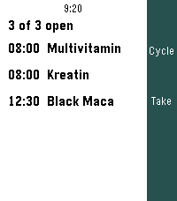
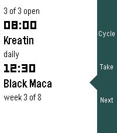
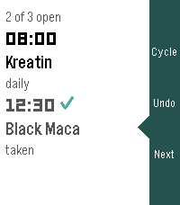
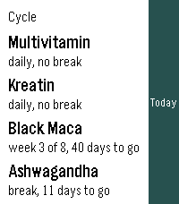
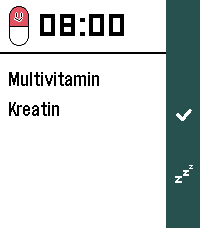
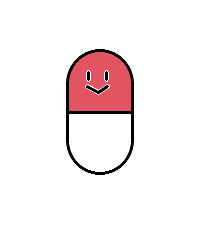
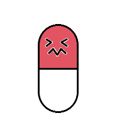
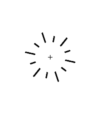

# SupCycle

Präparate im Blick behalten: was heute ansteht, und wo die zyklischen gerade in
ihrem Zyklus stehen.

Die Oberfläche folgt der **Sprache der Uhr** (Deutsch und Englisch, Englisch als
Rückfall) und dem Timeline-Look der Schwesterapps: weisser Grund, schwarze
Schrift, dunkle Seitenleiste rechts. Läuft auf emery, flint und gabbro.

## Screenshots

| | | |
|---|---|---|
|  |  |  |
| heute | Auswahl gewandert | abgehakt |
|  | | |
| Zyklus | | |
|  |  | |
| Erinnerung | Pilly | |
|  |  | |
| geschüttelt | verpufft | |

## Timeline-Look

Der Heute-Schirm ist der Liste der Systemtimeline nachgebaut: **LECO-Zeit**,
darunter der **Name fett**, darunter ein **gedämpfter Untertitel** mit dem, was
über den Eintrag zu sagen ist — „täglich", „Woche 3 von 8", „genommen".

Nachgebaut heisst hier: abgemessen, nicht erinnert. Die Vorlage sind
Emulator-Aufnahmen der echten Timeline (`pebble insert-pin`, dann vom
Zifferblatt nach oben). Daher stammen auch die Masse — die Seitenleiste ist
34 von 200 Pixeln breit, der Auswahlpfeil ragt 13 Pixel heraus und ist 25 hoch.
Ein vorher geschätzter Pfeil war deutlich zu klein und las sich wie ein
Versehen statt wie ein Zeiger.

Drei grosse Zeilen je Eintrag heissen wenige Einträge auf einmal — auf der
Pebble Time 2 zwei. Die Liste zieht deshalb mit der Auswahl mit. Ohne das
liefe die Auswahl unten hinaus und man wählte blind weiter.

Die kleine Uhrzeit über der Liste ist weg: die Timeline-LISTE hat keine, nur
das Pin-Detail. Die sechzehn Pixel gehören dem ersten Eintrag.

Alles steht in **reinem Schwarz** — auch die Untertitel, und auch das
Abgehakte. Grau (85,85,85) sah auf dem Emulator ordentlich aus und wusch auf
der echten Uhr aus; das Display leuchtet nicht, es spiegelt. Nachgemessen ist
in der Systemtimeline auch der Untertitel reines Schwarz, die Staffelung kommt
dort allein aus der Schriftgrösse.

Unter dem Strich steht kein „genommen" mehr — der Strich sagt es schon, und
zweimal dasselbe zu sagen macht es nicht richtiger. Die Zeile bleibt beim
Rhythmus, der ja weiter gilt.

Was genommen ist, wird **gestrichen** statt ausgegraut: derselbe Strich
wie auf einer Liste aus Papier, und bei jedem Licht deutlich. Er ist so lang
wie der Text wirklich ist, nicht wie sein Kasten — gemessen mit derselben
Schrift und demselben Kasten, damit er auch bei einem abgeschnittenen Namen
stimmt. Und er sitzt auf sechs Zehnteln der Zeilenhöhe, nicht auf der Hälfte:
die Schrift hat oben Vorlauf, die Mitte des Kastens liegt über der Mitte der
Buchstaben.

In der Zyklusansicht richtet sich die Schriftgrösse nach dem Platz: solange
ALLE Präparate gross hineinpassen, stehen sie gross da, sonst eine Nummer
kleiner. Nach einer geratenen Anzahl zu schalten hiess, das letzte gross
anzuschreiben und seinen Untertitel unter den Bildrand zu schieben.

## Bedienung

Ein Bildschirm, zwei Ansichten.

| Taste | Aktion |
|---|---|
| Oben | zwischen **Heute** und **Zyklus** wechseln |
| Mitte | das Gewählte abhaken — nochmal drücken nimmt den Haken zurück |
| Unten | den nächsten Eintrag wählen |
| Zurück | App verlassen |

Die Auswahl zeigt einen **Pfeil in der Farbe der Seitenleiste**, der nach links
auf den Eintrag hinausragt — genau wie in der Systemtimeline.

Den Haken zurücknehmen zu können ist hier richtig, anders als beim Glas in
Drinktervall: ein getrunkenes Glas lässt sich nicht ungetrunken machen, ein
Fehlgriff auf der Uhr aber sehr wohl. Und ein falscher Haken im Plan ist
schlimmer als keiner — er sagt, man habe genommen, was man nicht genommen hat.

Die Hinweise in der Seitenleiste bleiben klein. Sie stehen in einer 34 Pixel
schmalen Spalte, und „Cycle" bricht dort in jeder grösseren Schrift um. Wichtig
ist, was links steht; die Leiste ist Beiwerk.

Beim Abhaken spielt **Pilly** — auf dem Heute-Schirm wie im Erinnerungsfenster.
Beim Zurücknehmen nicht: eine Feier für einen Fehlgriff wäre verkehrt herum.

Gefeiert wird die **Einnahme, nicht die einzelne Tablette**. Stehen Kreatin und
Vitamine beide auf acht Uhr, ist das ein Termin und nicht zwei — Pilly spielt
erst, wenn beides abgehakt ist. Das Erinnerungsfenster hielt es immer schon so,
weil es die ganze Gruppe auf einmal abhakt; der Heute-Schirm zählte bis dahin
einzeln.

Wem das zu viel ist, schaltet die Animation **in den Einstellungen ab**. Sie
steht dort ganz oben und nicht je Präparat: sie gehört zur App, nicht zum
einzelnen Eintrag. Abgeschaltet heisst nicht, dass das Erinnerungsfenster
stehen bleibt — es geht dann direkt zu, denn der Weg hinaus führte bis dahin
über das Ende der Animation.

**Heute** zeigt, was ansteht, mit Haken bei dem, was schon genommen ist. Was
heute nicht dran ist, steht gar nicht da — in der Pause will man nicht daran
erinnert werden, dass man pausiert. Die Haken gelten für einen Tag und fallen um
Mitternacht weg.

**Zyklus** zeigt für jedes Präparat die laufende Phase: „Woche 3 von 8, noch 40
Tage" oder „Pause, noch 11 Tage". Dauerhafte stehen als „täglich" da.

Der Stand steht auch im App-Glance des Starters.

## Der Plan

Alles wird auf der **Konfigseite der Telefon-App** eingetragen — sechs Plätze,
je mit Name, Uhrzeit, dem Rhythmus und „Zyklus läuft seit". Ein Platz ohne
Namen bleibt leer.

Der Rhythmus sind drei Zahlen: **alle X Tage**, **für Y Wochen**, **Z Wochen
Pause**.

- X = 1 heisst täglich. X = 3 heisst jeden dritten Tag, ab dem Ankertag gezählt.
- **Y leer heisst unbegrenzt** — dann gibt es weder Kur noch Pause.
- Z zählt nur, wenn Y gesetzt ist. Eine Pause ohne Einnahmewochen wäre eine
  Angabe über etwas, das nicht stattfindet, und wird verworfen.

Eine eigene Auswahl „täglich oder zyklisch" gibt es nicht mehr. Sie stellte
eine Frage, deren Antwort in den Feldern darunter noch einmal stand — und zwei
Stellen für dieselbe Aussage können sich widersprechen. Jetzt ergibt sich der
Rhythmus aus dem, was eingetragen ist.

Ein Eintrag misst damit 26 statt 25 Byte. Die Uhr liest **beide Längen**: sonst
stünde nach einer Aktualisierung „Noch kein Plan" da, bis jemand die
Einstellungen öffnet. Aus dem alten Modus wird dabei das neue Schema — täglich
hiess dort „keine Pause", also Y = leer.

Ganz oben steht, **wie viele Präparate** es sind — nur so viele Plätze zeigt die
Seite. Ohne diese Vorwahl stünden dort immer sechs Abschnitte, von denen die
meisten leer bleiben, und man suchte seinen Eintrag zwischen Platzhaltern.

Das Verbergen greift **nicht an der `section` an**. Clay legt beim Aufbau nur
Nicht-Section-Elemente in sein Verzeichnis; aus einer `section` wird ein blosses
`<div class="section">`, ihre `id` fällt weg. `getItemById('slot1')` gab deshalb
immer `undefined` zurück — und weil die Schleife das stillschweigend übersprang,
tat die Vorwahl lange Zeit **gar nichts**, ohne dass es irgendwo aufgefallen
wäre.

Die Kennung hängt jetzt an der **Überschrift**, die sie behält. Von deren
Element aus findet `closest('.section')` den umgebenden Kasten, und der wird
verborgen. Nur die Felder zu verbergen genügte nicht: `.section` hat eigenen
Hintergrund und Schatten und bliebe als leerer grauer Kasten stehen.

`tools/clay_count_test.js` baut Clay so weit nach, wie es dafür nötig ist —
insbesondere **ohne** Kennungen für Sections. Wer den alten Weg wieder einbaut,
fällt dort durch statt erst auf dem Telefon.

Sechs feste Plätze statt einer Liste zum Anlegen und Löschen: Clay kennt keine
dynamischen Listen, und sie nachzubauen hiesse, die Seite selbst zu schreiben.
Sechs Zeilen decken jeden Stack ab, den man von Hand pflegt.

**„Zyklus läuft seit"** verschiebt den Ankertag zurück, damit die Uhr sofort die
richtige Phase zeigt, statt bei Woche 1 anzufangen. Wer seit fünf Wochen
Ashwagandha nimmt, trägt fünf Wochen ein und sieht Woche 5.

Die Uhr bekommt den fertigen Plan als **einen Datenblock** (25 Byte je Eintrag)
und rechnet daraus selbst aus, was heute ansteht. Sie fragt nie wieder nach und
läuft ohne Telefon mit dem zuletzt empfangenen Plan weiter.

Wie bei Drinktervall liegt der Plan **zusätzlich im Telefonspeicher**: die
Konfigseite geht auch dann auf, wenn die Watchapp nicht läuft, und dann erreicht
sie kein AppMessage. Der Block wird beim nächsten Start nachgereicht. Ohne
diesen zweiten Weg verpuffte jede Eingabe still.

## Gerechnet wird in Tagen

Nicht in Sekunden. Sommerzeit verschiebt einen Tag um eine Stunde, und über acht
Wochen summiert sich das zu einem Fehler von einem Tag — der Zyklus schaltete
dann einen Tag zu früh oder zu spät um. Uhr und Telefon zählen beide ganze Tage
seit der Epoche, aus der Ortszeit.

## Bauen und prüfen

```sh
tools/sync_supcycle.sh <Quellordner>            # spiegeln + bauen
tools/sync_supcycle.sh <Quellordner> demo       # mit Beispielplan
sh tools/selftest.sh <Quellordner>                  # Zyklusrechnung
sh tools/test_remind.sh <Quellordner>               # Weckpfad und Animation
node tools/pkjs_pin_test.js                         # Timeline-Pins
node tools/clay_count_test.js   # Anzahlsvorwahl der Konfigseite
node tools/strings_check.js src/c/strings_table.h
```

`src/c/cycle.c` hängt bewusst an nichts — kein `pebble.h`, nur Ganzzahlen. Das
ist hier kein Selbstzweck: **eine Zyklusrechnung, die um einen Tag danebenliegt,
fällt im Betrieb erst nach Wochen auf, und dann hat man schon falsch dosiert.**
`cycle_selftest.c` stellt sie gegen 34 von Hand nachgerechnete Erwartungen.

Der Test läuft **im Emulator, auf der 32-Bit-ARM-Zielarchitektur** — auf dem
Baurechner steht kein C-Compiler, nur der ARM-Compiler der SDK. Ein Test, der
nie läuft, ist keiner.

`demo` setzt einen Beispielplan ein, damit sich beide Ansichten im Emulator
ansehen lassen; dort gibt es keine Konfigseite. Die Zyklen stehen dabei
absichtlich in verschiedenen Phasen — eines in der Einnahme, eines in der Pause
—, sonst sähe man nur den halben Fall.

## Erinnerungen

Zur eingetragenen Uhrzeit meldet sich die Uhr: ein Vollbild mit der Kapsel, der
Uhrzeit und dem, was ansteht. Dreimal doppelt vibrieren im Abstand von zwanzig
Sekunden, dann Ruhe — wer nicht hinsieht, soll nicht endlos gerüttelt werden.

| Taste | Aktion |
|---|---|
| Mitte | genommen — abhaken, Kapsel zerplatzt, App schliesst |
| Unten | später — in 15 Minuten nochmal |
| Zurück | wegdrücken, ohne zu zählen |

Zwei Präparate zur selben Uhrzeit ergeben **eine** Erinnerung mit zwei Zeilen,
nicht zwei Erinnerungen. Und ist zu dieser Zeit schon alles genommen, erscheint
gar nichts — eine Erinnerung an etwas bereits Genommenes wäre schlimmer als
keine.

**In der Pause schweigt die Uhr.** Sonst hakt man aus Gewohnheit ab, und der
Zyklus ist wertlos.

**Der Schirm geht dabei an.** Ein Pebble-Wakeup startet die App im Vordergrund;
einen stillen Hintergrundlauf gibt es nicht. Nach dem Abhaken schliesst sie sich
wieder.

Pebble erlaubt höchstens **acht** geplante Wakeups je App. Geplant werden immer
die nächsten acht über zwei Tage hinweg, und bei jedem Start neu — so hält sich
der Weckplan selbst aktuell, auch nach einem Neustart, einer Zeitumstellung oder
einem Zyklus, der über Nacht in die Pause gewechselt ist.

## Die Kapsel

Pilly folgt dem Glas aus Drinktervall: dasselbe Strichbild, dasselbe Aufploppen
mit Überschwingen, derselbe Strahlenkranz zum Schluss.
Das Gesicht ist gegenüber der ersten Fassung um gut ein Drittel gewachsen,
gestreckt um seine eigene Mitte und nicht um die der Kapsel — sonst wäre der
Seitenblick mitgewandert.

Dazwischen wird sie **geschüttelt** und verzieht das Gesicht: die Augen kneifen
sich zu `><` zusammen, der Mund wird zum Zickzack. Danach ist es ausgestanden,
sie lächelt wieder und verpufft. Zwei Gesichter statt einem — wie beim Glas,
das beim Leeren ein Schluck-Gesicht macht.

Oben rot, unten weiss, **Gesicht auf der roten Hälfte** — dort, wo man bei
einem Gegenüber hinsieht. Jeder Strich wird erst mit weissem Saum und dann
schwarz gezogen, er hebt sich also auch auf Rot ab. Auf der Schwarz-Weiss-Uhr
wird aus Rot Schwarz; die Zweiteilung bleibt erkennbar.

Sie ist fast doppelt so hoch wie breit (72 zu 132). Gedrungener sähe sie aus wie
eine Tablette; erst dieses Verhältnis liest sich als Kapsel.

Gebaut ohne Zuschneiden — die SDK bietet dafür nichts Öffentliches. Statt
dessen: erst die ganze Kapsel weiss, dann die obere Hälfte als Rechteck mit nur
oben runden Ecken darüber. Das trifft die Form genau, weil der Radius gleich der
halben Breite ist.

## Timeline-Pins

Was heute ansteht, steht auch in der Timeline — ein Pin je Präparat, zur
eingetragenen Uhrzeit. Genommenes wechselt das Symbol und sagt es im
Untertitel.

**Die Zyklusrechnung bleibt dabei an einer einzigen Stelle.** Die Uhr schickt
dem Telefon nur das Datum und zwei Bitmasken — was heute ansteht, und was davon
schon genommen ist. Namen und Uhrzeiten hat die Telefonseite ohnehin, sie hat
den Plan ja selbst gebaut. Die Zyklen in JavaScript nachzubauen hiesse, zwei
Wahrheiten zu pflegen, die auseinanderlaufen können.

**Das Datum kommt als JJJJMMTT**, nicht als Tagesnummer. Der erste Entwurf
schickte Tage seit der Epoche; die Uhr bildet die aus ihrer *Ortszeit*, und das
Telefon rechnete sie über UTC zurück — bei positiver Zeitzone landete der Pin
einen Tag zu früh, also in der Vergangenheit. Der Prüfstand hat das gefunden,
bevor es eine Uhr gesehen hat.

Geprüft mit `tools/pkjs_pin_test.js` (22 Prüfungen): Kennung, Zeitpunkt,
Symbole, und dass ein unveränderter Pin **nicht** erneut hinausgeht, ein
abgehakter aber schon. Gegenprobe gemacht — nimmt man den Tag aus der Kennung,
fallen drei Prüfungen; nimmt man den Zustand aus der Signatur, zwei.

## Noch nicht drin

**Health Connect.** Für diesen Stack lohnt es nicht: Kreatin, Maca und
Ashwagandha haben dort keine Felder, und beim Multivitamin fehlen ausgerechnet
B6 und B12.

## Lizenz

Gemeinfrei, [CC0 1.0](LICENSE). Kopieren, ändern, verkaufen, einbauen — ohne
Bedingung, ohne Namensnennung, ohne Rückfrage.
