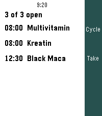
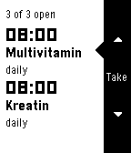
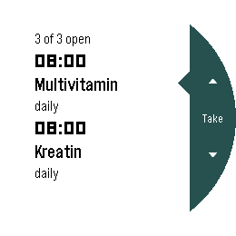
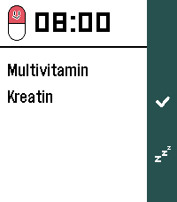
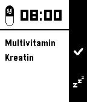
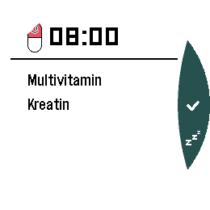
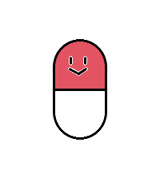
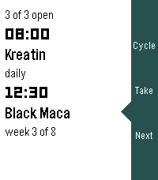
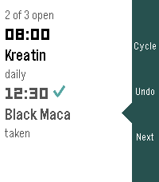
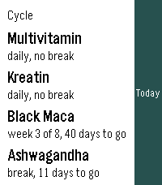

# SupCycle

Präparate im Blick behalten: was heute ansteht, und wo die zyklischen gerade in
ihrem Zyklus stehen.

Die Oberfläche folgt der **Sprache der Uhr** (Deutsch, Englisch, Französisch,
Italienisch und Spanisch, Englisch als Rückfall - siehe [Sprachen](#sprachen)) und dem Timeline-Look der Schwesterapps: weisser Grund, schwarze
Schrift, dunkle Seitenleiste rechts. Läuft auf emery, flint und gabbro.

## Screenshots

Drei Uhren, derselbe Schirm — und das ist nicht selbstverstaendlich: 200×228
in Farbe, 144×168 schwarzweiss, 260×260 rund.

| | emery | flint | gabbro |
|---|---|---|---|
| **heute** |  |  |  |
| **Erinnerung** |  |  |  |
| **Pilly** |  |  |  |

Auf flint ist Pilly schwarzweiss — die Uhr hat keine Farbe, und ein Raster
statt Rot waere ein Muster und kein Gesicht. Der ganze Satz liegt je Uhr in
`screenshots/`; hier die acht Schirme auf emery:

| | | |
|---|---|---|
|  |  |  |
| heute | Auswahl gewandert | abgehakt |
|  | | |
| Zyklus | | |
|  |  | |
| Erinnerung | Pilly | |
|  |  | |
| geschüttelt | verpufft | |

## Timeline-Look

Der Heute-Schirm ist der Liste der Systemtimeline nachgebaut: **LECO-Zeit**,
darunter der **Name fett**, darunter ein **gedämpfter Untertitel** mit dem, was
über den Eintrag zu sagen ist — „täglich", „Woche 3 von 8", „genommen".

Nachgebaut heisst hier: abgemessen, nicht erinnert. Die Vorlage sind
Emulator-Aufnahmen der echten Timeline (`pebble insert-pin`, dann vom
Zifferblatt nach oben). Daher stammen auch die Masse — die Seitenleiste ist
34 von 200 Pixeln breit, der Auswahlpfeil ragt 13 Pixel heraus und ist 25 hoch.
Ein vorher geschätzter Pfeil war deutlich zu klein und las sich wie ein
Versehen statt wie ein Zeiger.

Drei grosse Zeilen je Eintrag heissen wenige Einträge auf einmal — auf der
Pebble Time 2 zwei. Die Liste zieht deshalb mit der Auswahl mit. Ohne das
liefe die Auswahl unten hinaus und man wählte blind weiter.

Die kleine Uhrzeit über der Liste ist weg: die Timeline-LISTE hat keine, nur
das Pin-Detail. Die sechzehn Pixel gehören dem ersten Eintrag.

Alles steht in **reinem Schwarz** — auch die Untertitel, und auch das
Abgehakte. Grau (85,85,85) sah auf dem Emulator ordentlich aus und wusch auf
der echten Uhr aus; das Display leuchtet nicht, es spiegelt. Nachgemessen ist
in der Systemtimeline auch der Untertitel reines Schwarz, die Staffelung kommt
dort allein aus der Schriftgrösse.

Unter dem Strich steht kein „genommen" mehr — der Strich sagt es schon, und
zweimal dasselbe zu sagen macht es nicht richtiger. Die Zeile bleibt beim
Rhythmus, der ja weiter gilt.

Was genommen ist, wird **gestrichen** statt ausgegraut: derselbe Strich
wie auf einer Liste aus Papier, und bei jedem Licht deutlich. Er ist so lang
wie der Text wirklich ist, nicht wie sein Kasten — gemessen mit derselben
Schrift und demselben Kasten, damit er auch bei einem abgeschnittenen Namen
stimmt. Und er sitzt auf sechs Zehnteln der Zeilenhöhe, nicht auf der Hälfte:
die Schrift hat oben Vorlauf, die Mitte des Kastens liegt über der Mitte der
Buchstaben.

In der Zyklusansicht richtet sich die Schriftgrösse nach dem Platz: solange
ALLE Präparate gross hineinpassen, stehen sie gross da, sonst eine Nummer
kleiner. Nach einer geratenen Anzahl zu schalten hiess, das letzte gross
anzuschreiben und seinen Untertitel unter den Bildrand zu schieben.

## Bedienung

Ein Bildschirm, zwei Ansichten.

| Taste | In **Heute** | In **Zyklus** |
|---|---|---|
| Oben | einen Eintrag zurück | eine Zeile hoch |
| Unten | einen Eintrag weiter | eine Zeile runter |
| Mitte | abhaken — nochmal drücken nimmt den Haken zurück | zurück nach Heute |
| Mitte **lang** | zur Zyklusansicht | zurück nach Heute |
| Zurück | App verlassen | App verlassen |

Oben und unten tun in beiden Ansichten dasselbe: sie bewegen sich durch die
Liste. Vorher lag der Ansichtswechsel auf der oberen Taste — die wird jetzt
fürs Wählen gebraucht, und eine Ansicht, die man zweimal am Tag aufruft,
verdient keine eigene Taste.

Der lange Druck meldet sich, sobald die Haltezeit erreicht ist, nicht erst
beim Loslassen — so bestätigt der Schirm den Wechsel, während der Finger noch
liegt. Die Haltezeit ist die Systemvorgabe (500 ms); eine eigene Zahl hiesse,
dass sich diese App anders anfühlt als die anderen auf der Uhr.

Die Auswahl zeigt einen **Pfeil in der Farbe der Seitenleiste**, der nach links
auf den Eintrag hinausragt — genau wie in der Systemtimeline.

Den Haken zurücknehmen zu können ist hier richtig, anders als beim Glas in
Drinktervall: ein getrunkenes Glas lässt sich nicht ungetrunken machen, ein
Fehlgriff auf der Uhr aber sehr wohl. Und ein falscher Haken im Plan ist
schlimmer als keiner — er sagt, man habe genommen, was man nicht genommen hat.

Oben und unten stehen in der Seitenleiste **Dreiecke, keine Wörter**. „Hoch"
und „Weiter" wären zwei Wörter für dieselbe Sache in zwei Richtungen, und in
einer 34 Pixel schmalen Spalte ist jedes Wort eines zu viel — die
Systemtimeline schreibt dort gar nichts. Sie erscheinen nur, wenn es etwas zu
blättern gibt: ein Zeichen für eine Taste, die nichts tut, ist schlimmer als
keines.

In der Mitte steht weiter ein Wort, und das bleibt klein: in dieser Spalte
bricht jede grössere Schrift um. Wichtig ist, was links steht; die Leiste ist
Beiwerk.

Die Zyklusliste blättert, wenn nicht alle Präparate auf einen Schirm passen —
bei sechs Einträgen ist das der Fall. Vorher fiel das letzte einfach unter den
Bildrand. Auf der **runden** Uhr endet der Platz früher, als die Bildhöhe sagt:
bei x = 38 reicht der Kreis nur von y 38 bis 222, nicht bis 260. Wer gegen die
Rechteckhöhe misst, schreibt die letzte Zeile hinter die Rundung.

## Ein Overlay, zwei Fenster

Pilly liegt als eigener Layer über dem Fenster, und es gibt davon **genau
einen** für die ganze App. Das ist eine Falle, denn ein Wecker schiebt das
Erinnerungsfenster über den Hauptschirm — beide wollen ihn.

Der Overlay hat deshalb einen **Besitzer**. Er entsteht, wenn ein Fenster
*erscheint*, nicht wenn es lädt; und ein Fenster räumt ihn beim Entladen nur
weg, wenn er noch ihm gehört. Beide Reihenfolgen gehen damit auf: ob das
Erinnerungsfenster zuerst entlädt oder der Hauptschirm zuerst wieder erscheint,
am Ende hat der sichtbare Schirm seinen Overlay.

Und `pill_fx_play` **meldet**, wenn es nicht spielen kann, statt stillschweigend
zurückzukehren. Vorher setzte der Aufrufer "es läuft eine Animation", bekam nie
ein Ende gemeldet und blockierte sich selbst für immer: weisser Schirm, alle
Tasten tot. Ein Ende, das nicht kommt, ist schlimmer als gar keine Animation.

Beim Abhaken spielt **Pilly** — auf dem Heute-Schirm wie im Erinnerungsfenster.
Beim Zurücknehmen nicht: eine Feier für einen Fehlgriff wäre verkehrt herum.

Wird sie geschüttelt, **bleibt die verzogene Miene bis zum Schluss** — auch
während die Kapsel schrumpft. Vorher lächelte sie wieder, sobald das Schütteln
aufhörte; das sah aus, als sei nichts gewesen, und nahm dem Schütteln die
Pointe.

Gefeiert wird die **Einnahme, nicht die einzelne Tablette**. Stehen Kreatin und
Vitamine beide auf acht Uhr, ist das ein Termin und nicht zwei — Pilly spielt
erst, wenn beides abgehakt ist. Das Erinnerungsfenster hielt es immer schon so,
weil es die ganze Gruppe auf einmal abhakt; der Heute-Schirm zählte bis dahin
einzeln.

Wem das zu viel ist, schaltet die Animation **in den Einstellungen ab**. Sie
steht dort ganz oben und nicht je Präparat: sie gehört zur App, nicht zum
einzelnen Eintrag. Abgeschaltet heisst nicht, dass das Erinnerungsfenster
stehen bleibt — es geht dann direkt zu, denn der Weg hinaus führte bis dahin
über das Ende der Animation.

**Heute** zeigt, was ansteht, mit Haken bei dem, was schon genommen ist. Was
heute nicht dran ist, steht gar nicht da — in der Pause will man nicht daran
erinnert werden, dass man pausiert. Die Haken gelten für einen Tag und fallen um
Mitternacht weg.

**Zyklus** zeigt für jedes Präparat die laufende Phase: „Woche 3 von 8, noch 40
Tage" oder „Pause, noch 11 Tage". Dauerhafte stehen als „täglich" da.

Der Stand steht auch im App-Glance des Starters.

## Der Plan

Alles wird auf der **Konfigseite der Telefon-App** eingetragen — sechs Plätze,
je mit Name, Uhrzeit, dem Rhythmus und „Zyklus läuft seit". Ein Platz ohne
Namen bleibt leer.

Der Rhythmus sind drei Zahlen: **alle X Tage**, **für Y Wochen**, **Z Wochen
Pause**.

- X = 1 heisst täglich. X = 3 heisst jeden dritten Tag, ab dem Ankertag gezählt.
- **Y leer heisst unbegrenzt** — dann gibt es weder Kur noch Pause.
- **Y gesetzt, Z leer: eine einmalige Kur.** Nach Y Wochen ist sie vorbei —
  das Präparat steht nicht mehr an, die Uhr erinnert nicht mehr, und die
  Zyklusseite sagt „Kur beendet“. Bis 0.15.0 lief sie endlos weiter („Woche 72
  von 4“).
- Z zählt nur, wenn Y gesetzt ist. Eine Pause ohne Einnahmewochen wäre eine
  Angabe über etwas, das nicht stattfindet, und wird verworfen.

Eine eigene Auswahl „täglich oder zyklisch" gibt es nicht mehr. Sie stellte
eine Frage, deren Antwort in den Feldern darunter noch einmal stand — und zwei
Stellen für dieselbe Aussage können sich widersprechen. Jetzt ergibt sich der
Rhythmus aus dem, was eingetragen ist.

Ein Eintrag misst damit 26 statt 25 Byte. Die Uhr liest **beide Längen**: sonst
stünde nach einer Aktualisierung „Noch kein Plan" da, bis jemand die
Einstellungen öffnet. Aus dem alten Modus wird dabei das neue Schema — täglich
hiess dort „keine Pause", also Y = leer.

Ganz oben steht, **wie viele Präparate** es sind — nur so viele Plätze zeigt die
Seite. Ohne diese Vorwahl stünden dort immer sechs Abschnitte, von denen die
meisten leer bleiben, und man suchte seinen Eintrag zwischen Platzhaltern.

Das Verbergen greift **nicht an der `section` an**. Clay legt beim Aufbau nur
Nicht-Section-Elemente in sein Verzeichnis; aus einer `section` wird ein blosses
`<div class="section">`, ihre `id` fällt weg. `getItemById('slot1')` gab deshalb
immer `undefined` zurück — und weil die Schleife das stillschweigend übersprang,
tat die Vorwahl lange Zeit **gar nichts**, ohne dass es irgendwo aufgefallen
wäre.

Die Kennung hängt jetzt an der **Überschrift**, die sie behält. Von deren
Element aus findet `closest('.section')` den umgebenden Kasten, und der wird
verborgen. Nur die Felder zu verbergen genügte nicht: `.section` hat eigenen
Hintergrund und Schatten und bliebe als leerer grauer Kasten stehen.

`tools/clay_count_test.js` baut Clay so weit nach, wie es dafür nötig ist —
insbesondere **ohne** Kennungen für Sections. Wer den alten Weg wieder einbaut,
fällt dort durch statt erst auf dem Telefon.

Sechs feste Plätze statt einer Liste zum Anlegen und Löschen: Clay kennt keine
dynamischen Listen, und sie nachzubauen hiesse, die Seite selbst zu schreiben.
Sechs Zeilen decken jeden Stack ab, den man von Hand pflegt.

**„Zyklus läuft seit"** verschiebt den Ankertag zurück, damit die Uhr sofort die
richtige Phase zeigt, statt bei Woche 1 anzufangen. Wer seit fünf Wochen
Ashwagandha nimmt, trägt fünf Wochen ein und sieht Woche 5.

**Danach bleibt der Ankertag.** Die Seite kennt nur ganze Wochen; bis 0.15.0
rechnete jedes Speichern daraus einen neuen Anker, und der Zyklus rutschte um
bis zu sechs Tage, das Raster „alle X Tage“ mit ihm. Jetzt merkt sich die
Telefonseite je Platz den Anker als Datum, den sie als „seit N Wochen“ in die
Seite gestellt hat (`supcycle_anker`). Kommt derselbe Name mit derselben
Wochenzahl zurück, bleibt er; nur eine geänderte Wochenzahl oder ein neuer Name
setzt ihn neu. Beim Öffnen zeigt die Seite die Wochen von heute.

Die Uhr bekommt den fertigen Plan als **einen Datenblock** (26 Byte je Eintrag)
und rechnet daraus selbst aus, was heute ansteht. Sie fragt nie wieder nach und
läuft ohne Telefon mit dem zuletzt empfangenen Plan weiter.

Wie bei Drinktervall liegt der Plan **zusätzlich im Telefonspeicher**: die
Konfigseite geht auch dann auf, wenn die Watchapp nicht läuft, und dann erreicht
sie kein AppMessage. Der Block wird beim nächsten Start nachgereicht. Ohne
diesen zweiten Weg verpuffte jede Eingabe still.

## Gerechnet wird in Tagen

Nicht in Sekunden. Sommerzeit verschiebt einen Tag um eine Stunde, und über acht
Wochen summiert sich das zu einem Fehler von einem Tag — der Zyklus schaltete
dann einen Tag zu früh oder zu spät um.

**Ein Tag ist ein Datum** (`src/c/kalender.c`): die Tage vom 01.01.1970 bis zum
Datum der Ortszeit (days_from_civil). Uhr, Telefonseite und Boulder zählen so.
Bis 0.15.0 hiess „Tag“ die Ortsmitternacht in Sekunden, durch 86400 geteilt.
Das ist kein Kalendertag: östlich von Greenwich war es der Vortag, und in
London hatten Samstag und Sonntag der Frühjahrsumstellung dieselbe Nummer —
ein Haken vom Samstag stand am Sonntag noch da. Im Herbst sprang die Nummer
mitten am Tag.

**Die Umstellung verliert nichts.** Beim ersten Start stellt die Uhr ihren
gemerkten Tag und die Anker einmal um (Persist-Fach 9, Fassung 2), die
Telefonseite ihren gespeicherten Plan (`supcycle_tage`). Verschoben wird um
den Unterschied beider Zählungen *heute* — in Zürich +1, in New York 0, in
London im Sommer +1, im Winter 0. Was heute abgehakt ist, bleibt abgehakt, und
jeder Zyklus steht in derselben Phase wie vorher.

**Boulder und die Uhr-App kennen beide Zählungen.** Die Uhr schickt mit dem Plan
`PLANFASSUNG` (Schlüssel 10048, Wert 2): Anker als Kalendertag, und
Einnahmewochen ohne Pause sind eine Kur, die endet. Fehlt der Schlüssel, ist es
eine Uhr-App bis 0.15.0, und Boulder rechnet wie sie. Die Haken selbst hängen
in beiden Richtungen am Datum `TODAY` (JJJJMMTT), nicht an einer Tagesnummer:

| Boulder | Uhr-App | Haken | Vorschau „heute fällig“, bevor die Uhr sich meldet |
|---|---|---|---|
| neu | neu | bleiben | richtig |
| neu | bis 0.15.0 | bleiben | richtig (rechnet wie die alte Uhr) |
| bis 0.49 | neu | bleiben | östlich von Greenwich einen Tag daneben, und eine beendete Kur gilt als fällig - bis die Uhr sich meldet |
| bis 0.49 | bis 0.15.0 | bleiben | wie bisher |

Was die Uhr meldet (`DUE`, `TAKEN`), gilt in jedem Fall.

### Ein Haken gilt einen Tag

Ein Haken gilt für den Tag, den die Uhr sich gemerkt hat, und fällt mit dem
nächsten Tag weg. Springt die Uhr **zurück** — nach einem Neustart steht sie
kurz auf einer alten Zeit, oder das Telefon setzt die Zeitzone neu —, bleibt
der gemerkte Tag stehen (seit 0.13.3). Die Haken des echten Tages bleiben, auch
einer, den man setzt, während die Uhr noch auf gestern steht.

**Stand die Uhr vor** und wurde zurückgestellt, sieht das für die Uhr genauso
aus: Auch dann liegt sie hinter dem gemerkten Tag. Bis 0.14.0 hingen die Haken
des echten Tages dann am vorausgeeilten Tag und standen am echten Folgetag
noch da, als wäre genommen worden. Welche Zeit falsch war, weiss nur das
Telefon. In diesem Zustand trägt darum jede Meldung die Uhrzeit der Uhr
(`UHRZEIT`, Schlüssel 10047), und die Telefonseite antwortet mit ihrer.
Weichen beide höchstens 300 s ab und stehen auf demselben Tag, geht die Uhr
richtig: Heute gilt, die Haken bleiben, und am echten Folgetag sind sie weg.
Sonst bleibt der gemerkte Tag.

Was bleibt:

- Antwortet das Telefon nicht (keine Verbindung, pkjs läuft nicht), bleibt es
  beim Verhalten bis 0.14.0: Die Haken stehen am echten Folgetag noch da.
- Gefragt wird nur, während die App läuft und ihren Stand meldet: beim Start,
  bei jeder Erinnerung, nach einem Haken. Läuft sie am berichtigten Tag nicht
  mehr — etwa weil die Uhr nach der letzten Erinnerung gestellt wird und man
  die App an diesem Tag nicht mehr öffnet —, fragt sie nie. Am echten Folgetag
  steht die Uhr dann wieder auf dem gemerkten Tag, und die Haken stehen noch
  da wie bis 0.14.0.
- Springt die Uhr plausibel (ab 2025) mehr als zwei Tage zurück, gilt der
  gemerkte Tag ohne Rückfrage als falsch (seit 0.13.3). War es doch die Uhr,
  die so weit zurückstand, ist das Stellen danach für sie ein neuer Tag, und
  die Haken sind weg.
- Springt die Uhr vor, ist das für sie ein neuer Tag: Die Haken des echten
  Tages fallen weg (wie bisher).

Geprüft in `tools/plan_host_test.c` (vorwärts, rückwärts, abgehakt auf
gestern, Vorlauf mit und ohne Telefon, 300/301 s, Mitternacht),
`tools/phone_host_test.c` (Frage und Antwort) und `tools/pkjs_start_test.js`
(Antwort der Telefonseite).

## Bauen und prüfen

```sh
tools/sync_supcycle.sh <Quellordner>            # spiegeln + bauen
tools/sync_supcycle.sh <Quellordner> demo       # mit Beispielplan
sh tools/selftest.sh <Quellordner>                  # Zyklusrechnung
sh tools/test_remind.sh <Quellordner>               # Weckpfad und Animation
node tools/pkjs_pin_test.js                         # Timeline-Pins
node tools/clay_count_test.js   # Anzahlsvorwahl der Konfigseite
node tools/strings_check.js src/c/strings_table.h
sh tools/plan_host_test.sh      # Hakenzeiten, Zurücknehmen, Tageswechsel, Persist-Fächer (Rechner-C, pebble.h als Attrappe)
sh tools/phone_host_test.sh     # Startanfrage, Nachfassen, Nachholen, Frage nach der Zeit, Platz im Postausgang, Warten auf das Telefon
sh tools/tage_host_test.sh      # Kalendertage, Umstellung von 0.15.0, gespeicherter Plan, Kur, Zyklus-Selbsttest (Zürich, London, New York, UTC)
sh tools/remind_host_test.sh    # Weckplan: 60 Tage voraus, lange Pause, Wecker zum Neuplanen nur wenn nötig, Umstellungstage, Aufschub (drei Zonen)
sh tools/app_host_test.sh       # die ganze App: Weckstarts, Wecker bei offener App, Genommen und Telefon, Zyklusseite, Aufschub (drei Zonen)
node tools/pkjs_start_test.js   # Startzweige der Telefonseite, Antwort auf die Frage nach der Zeit
node tools/pkjs_tage_test.js    # Kalendertage und Anker auf der Telefonseite, Anker durch die Konfigseite
node tools/pkjs_clay_test.js    # Namen mit $ und < durch das echte Clay (nach npm install und pebble build)
node tools/catch_check.js       # kein catch ohne Log in der Telefonseite
sh tools/alle_tests.sh          # alles oben ohne Emulator, Node-Tests in drei Zonen - so läuft es in der CI
```

Den Clay-Test erst nach `pebble build`: `npm install` legt Clay nur als
`dist.zip` ab, entpackt wird es beim Bau. Ohne Bau geht es so:
`python3 -m zipfile -e node_modules/@rebble/clay/dist.zip node_modules/@rebble/clay/dist`.

**Die CI prüft vor dem Bauen** (`.github/workflows/bauen.yml`, Schritt
„Prüfen“): ein roter Test bricht den Lauf ab, dann wird nichts gebaut,
eingecheckt oder veröffentlicht. Clay entpackt sie dafür schon im Schritt
„Clay holen“ — bis dahin fand der Clay-Test es in der CI nicht, und jeder Lauf
auf `main` endete rot, ohne pbw.

`src/c/cycle.c` hängt bewusst an nichts — kein `pebble.h`, nur Ganzzahlen. Das
ist hier kein Selbstzweck: **eine Zyklusrechnung, die um einen Tag danebenliegt,
fällt im Betrieb erst nach Wochen auf, und dann hat man schon falsch dosiert.**
`cycle_selftest.c` stellt sie gegen 62 von Hand nachgerechnete Erwartungen.

Der Zyklustest läuft **im Emulator, auf der 32-Bit-ARM-Zielarchitektur**, wo
die Rechnung auch im Betrieb läuft — und mit denselben Erwartungen in
`tage_host_test.sh` auf dem Rechner, damit die CI ihn fährt. Die Host-Tests
laufen mit dem C-Compiler des Rechners und einer Attrappe von `pebble.h`
(`tools/host/`): Persist, AppMessage, Zeitgeber, Wecker (wie pebbleos: acht je
App, eine Minute Abstand), dazu Fenster und Tasten für den Test der ganzen App.

`demo` setzt einen Beispielplan ein, damit sich beide Ansichten im Emulator
ansehen lassen; dort gibt es keine Konfigseite. Die Zyklen stehen dabei
absichtlich in verschiedenen Phasen — eines in der Einnahme, eines in der Pause
—, sonst sähe man nur den halben Fall.

## Einstellen auf der Konfigseite

Den Plan stellt man auf der Konfigseite in der Pebble-App ein. **Die Uhr ist
die eine Stelle, an der er gilt.** Die Konfigseite schickt an die Uhr, und die
Uhr meldet mit jeder Nachricht ihren Plan und die Animation (`PLAN`, `FX`).
Die Telefonseite übernimmt das in die Konfigseite und die Timeline-Pins.
Boulder liest den Plan mit und ändert ihn nicht; es nimmt nur Haken zurück
(siehe [Hakenzeit und Zurücknehmen](#hakenzeit-und-zurücknehmen)).

Von 0.12.0 an liess sich der Plan auch in
[Kiesel-Helper](https://github.com/dysseus-pascal/Kiesel-Helper) ändern.
Kiesel-Helper ist seit dem 29.09.2026 archiviert, seine Aufgaben hat Boulder
übernommen. Bis 0.11 schickte die Telefonseite auf jede Anfrage der Uhr ihren
eigenen gespeicherten Plan zurück — eine Änderung aus Kiesel-Helper wäre beim
nächsten Start wieder überschrieben worden. Seither schickt sie ihn nur noch,
wenn er auf der Konfigseite geändert wurde und nie ankam, oder wenn die Uhr
gar keinen hat (neu installiert).

**Ein leerer Plan der Uhr überschreibt nie einen gespeicherten.** Bis 0.14.0
konnte genau das passieren: hörte die Telefonseite beim Start der App noch
nicht zu und lehnte die Startanfrage ab (NACK), galt die Anfrage auf der Uhr
trotzdem als erledigt. Beim Nachholen ging nur der Plan der Uhr hinaus —
bei einer frisch installierten Uhr ein leerer — und die Telefonseite legte ihn
über ihren gespeicherten. Im Emulator nachgestellt: frische Uhr, pkjs läuft
erst nach 8 s an, und das Telefon lehnt wie die echte Pebble-App ab, solange
pkjs nicht bereit ist (der Emulator selbst bestätigt alles). Seitdem:

- Die Startanfrage ist erst erledigt, wenn das Telefon sie bestätigt. Bis
  dahin trägt jede Meldung `REQUEST`, auch das Nachholen beim Wiederverbinden.
- Lehnt das Telefon sie ab, fasst die Uhr bis zu viermal nach, alle 3 s.
- Die Telefonseite legt einen leeren Plan der Uhr nie über einen
  gespeicherten, ob mit oder ohne Anfrage, sondern schickt ihr den gespeicherten.

**Namen mit `$` und `<` kommen unverändert durch.** Clay setzt die gespeicherten
Werte mit `String.replace` in die Seite ein, und dort sind `$&`, `$'`, `` $` ``
und `$$` Ersetzungsmuster; ein `</script>` im Namen beendete das Skript der
Seite. Bis 0.15.0 war die Seite mit so einem Namen kaputt. Clay bleibt
ungepatcht: es bekommt eine Marke statt der Einstellungen, und an ihre Stelle
setzt die Telefonseite danach das JSON, mit `<` als `\u003c`. Eine
abgebrochene Seite („CANCELLED“) bringt sie nicht mehr aus dem Tritt.

## Erinnerungen

Zur eingetragenen Uhrzeit meldet sich die Uhr: ein Vollbild mit der Kapsel, der
Uhrzeit und dem, was ansteht. Dreimal doppelt vibrieren im Abstand von zwanzig
Sekunden, dann Ruhe — wer nicht hinsieht, soll nicht endlos gerüttelt werden.
In der **Ruhezeit** der Uhr (`quiet_time_is_active`) bleibt das Vibrieren
ganz aus; der Schirm kommt trotzdem.

| Taste | Aktion |
|---|---|
| Mitte | genommen — abhaken, Kapsel zerplatzt, App schliesst |
| Unten | später — in 15 Minuten nochmal, höchstens dreimal |
| Zurück | wegdrücken — die Runde verfällt, die App schliesst |

Zwei Präparate zur selben Uhrzeit ergeben **eine** Erinnerung mit zwei Zeilen,
nicht zwei Erinnerungen. Und ist zu dieser Zeit schon alles genommen, erscheint
gar nichts — eine Erinnerung an etwas bereits Genommenes wäre schlimmer als
keine.

### Eine Erinnerung gilt einer Runde

**„Später" gehört zur Runde, nicht zum Tag.** Wer die Morgenrunde aufschiebt,
bekommt in fünfzehn Minuten die Morgenrunde nochmal — und nur die. Die
Mittagsrunde hat ihren eigenen Wecker und zeigt nur, was mittags ansteht. Bis
0.10.0 zeigte die Erinnerung nach einem Aufschub *alles*, was gerade offen war;
so trug die Mittagsrunde den Morgen nach, den man bewusst hatte liegen lassen.

**Höchstens dreimal.** Wer dreimal „später" sagt, meint „heute nicht": beim
vierten Druck verfällt die Runde wie beim Wegdrücken, und das Zeichen für
„später" ist dann schon aus der Leiste verschwunden. Unten auf dem Schirm steht,
der wievielte Aufschub es ist. Der Zähler gilt der Runde dieses Tages; bis
0.15.0 löschte ihn das Neustellen nach jedem Klopfen des Aufschubs, und jeder
Aufschub war wieder der erste.

**Der Aufschub überlebt einen Neustart.** Er liegt im Persist. Bis 0.10.0
stand er nur als Wecker — und weil die App bei jedem Start alle Wecker neu
stellt, fiel er weg, sobald irgendein anderer Wecker die App dazwischen
öffnete. Ein „später" am Morgen kam so manchmal nie wieder.

**Eine andere Runde lässt ihn stehen.** Abhaken oder Wegdrücken der Runde
08:10 löscht den Aufschub der Runde 08:00 nicht; bis 0.15.0 tat es das, und
08:00 kam nie wieder. Es gibt einen Aufschub, nicht mehrere: ein „später" zu
einer anderen Runde ersetzt ihn.

**Kurz davor geöffnet, klopft er trotzdem.** Jeder Start stellt alle Wecker
neu. Lag der Aufschub (oder eine Runde) weniger als 30 s voraus, fiel er bis
0.15.0 dabei weg — die App um 08:14:45 geöffnet, und der Aufschub von 08:15
kam nie. Jetzt klopft er höchstens 31 s nach dem Öffnen.

**Über Mitternacht bleibt es die Runde des Vortags.** 23:50 aufgeschoben
klopft um 00:05, zählt weiter und zeigt, was von ihr noch offen ist. Bis
0.15.0 klopfte ein Aufschub über Mitternacht nie. „Genommen" hakt dann nichts
ab: die Haken gelten für heute, und der von heute gehört der Runde 23:50 von
heute — sie soll am Abend wieder klopfen. Wurde die Runde vor Mitternacht auf
dem Heute-Schirm abgehakt, ist ihr Aufschub vorbei.

**Was vor Mitternacht abgehakt wurde, bleibt weg.** Nach Mitternacht kennt die
Uhr die Haken von gestern nicht mehr. Der Aufschub merkt sich deshalb seine
Plätze (Persist-Fach 11), und jeder Haken bis Mitternacht streicht einen:
Mg und Ca um 23:50 aufgeschoben, um 23:55 Mg abgehakt — um 00:05 steht nur Ca
da. Ebenso zeigt eine Erinnerung, die über Mitternacht offen steht, nur, was
bei ihrem Erscheinen offen war. Bis sc-r2 stand das Abgehakte wieder als
fällig da.

**Gestern gilt nur ein Aufschub.** Ein gewöhnlicher Wecker ist immer die Runde
von heute — auch nach einer Reise nach Westen, wenn der Wecker von 08:00
Zürich in New York um 02:00 klopft. Bis 0.15.0 wurde das aus der Uhrzeit
geschlossen: lag noch ein Aufschub derselben Runde vom Vortag herum, galt die
heutige als die von gestern, „Genommen" hakte nichts ab, und um 08:00 Ortszeit
klopfte sie nochmal. Ist eine Runde heute erledigt, ist ihr Aufschub ganz
vorbei, samt Zähler und Tag.

**Wegdrücken schliesst die App.** Zurück auf der Erinnerung heisst „nicht jetzt
und nicht nachfragen": kein Aufschub, keine weitere Erinnerung zu dieser Runde,
und die App geht zu — nicht auf den Heute-Schirm. Was liegen blieb, steht dort
weiter offen und lässt sich **nachholen**: App öffnen, Eintrag wählen, Mitte.
So wie in Drinktervall ein Glas nachgetragen wird. Um Mitternacht verfällt es.

**Auf eine erledigte Runde wird gar kein Wecker mehr gestellt.** Das klingt
selbstverständlich und war es bis 0.9.0 nicht: der Weckplan sah nur, *wann*
etwas fällig ist, nie *ob* es noch aussteht. Wer seine Morgenrunde vor acht Uhr
von Hand abhakte, wurde um acht trotzdem geweckt. Die Erinnerung fand dann
nichts zu zeigen und erschien nicht — aber die App war offen, und stehen blieb
der **Heute-Schirm**, auf dem Abgehaktes durchgestrichen mitsteht. Das las sich
wie „schon wieder fällig".

Die beiden Schirme sind verschiedene Dinge, und das soll man ihnen ansehen:
die **Erinnerung** zeigt nur, was gerade zu nehmen ist. Was schon genommen
wurde, steht auf dem **Heute-Schirm** — dann aber, weil man ihn selbst geöffnet
hat.

Abhaken auf dem Heute-Schirm stellt die Wecker deshalb neu, genau wie das
Abhaken in der Erinnerung es immer schon tat. Und käme doch ein Wecker ohne
etwas zu zeigen — etwa einer aus einem älteren Weckplan, den diese Fassung nie
gestellt hat —, schliesst sich die App sofort wieder, statt den Heute-Schirm
stehen zu lassen.

**In der Pause schweigt die Uhr.** Sonst hakt man aus Gewohnheit ab, und der
Zyklus ist wertlos.

**Der Schirm geht dabei an.** Ein Pebble-Wakeup startet die App im Vordergrund;
einen stillen Hintergrundlauf gibt es nicht. Nach dem Abhaken schliesst sie sich
wieder — **aber erst, wenn das Telefon den Haken hat**, höchstens 5 s später,
ohne Verbindung sofort. Bis 0.15.0 ging sie gleich zu, und die Uhr verwarf, was
noch im Postausgang lag.

**Ein Wecker bei offener App erinnert genauso.** Läuft die App schon, startet
die Uhr sie nicht neu, sondern meldet den Wecker nur — bis 0.15.0 hörte niemand
zu, und die Erinnerung verpuffte samt dem nächsten Weckplan.

**Auch bei offener Erinnerung.** Steht die Erinnerung von 08:00 noch
unbeantwortet da (sie geht nicht von selbst zu), und um 12:30 klopft die
nächste Runde, kommt sie dazu: es vibriert neu, und beide stehen da, oben die
neue Uhrzeit. „Genommen“ hakt alle ab. „Später“ gilt der neuen Runde — es gibt
nur einen Aufschub —, die ältere bleibt auf dem Heute-Schirm offen. Bis 0.15.0
schluckte ein liegen gelassenes Fenster jede weitere Runde des Tages: keine
Vibration, nichts zu sehen, und ihr Wecker war verbraucht. Klopft eine Runde,
während die Erinnerung nach dem Abhaken nur noch auf das Telefon wartet,
erscheint sie danach, statt dass die App zugeht.

Pebble erlaubt höchstens **acht** geplante Wakeups je App. Geplant werden die
nächsten sieben Erinnerungen, **bis zu 60 Tage voraus** (steht darin keine,
bis zur ersten), und bei jedem Start
neu — so hält sich der Weckplan selbst aktuell, auch nach einem Neustart, einer
Zeitumstellung oder einem Zyklus, der über Nacht in die Pause gewechselt ist.
Bis 0.15.0 waren es zwei Tage: ein Präparat „alle 2 Tage“ oder eine Pause
liess danach keinen Wecker stehen, und die Erinnerungen hörten still auf.
Die Uhrzeit gilt auch am Umstellungstag: 08:00 ist 08:00, nicht 07:00 oder
09:00.

**Der achte ist der Wecker zum Neuplanen**, um 03:00 — aber nur, wenn sonst
lange nichts klopft: in einer Pause oder bei einem Raster über einen Tag. Die
App stellt dann alle Wecker neu und geht sofort wieder zu — ohne Fenster, ohne
Vibration, ohne Nachricht ans Telefon. Er fängt ab, was die Vorausplanung
allein nicht kann: eine neue Zeitzone, eine Sommerzeitregel, die die Uhr erst
später erfährt, und eine lange Pause. Verpasst ihn die Uhr (aus), meldet er
sich nicht.

Zuerst stand er jede Nacht. Ein Wecker startet die App aber im Vordergrund und
verdrängt, was dort läuft: wer um 03:00 navigierte, landete auf dem
Zifferblatt. Kommt bis zum 03:00 nach dem nächsten ohnehin eine Erinnerung,
plant die neu — bei täglichen Präparaten also immer. Der Preis: nach einer
Reise in eine andere Zeitzone klopft die erste Erinnerung noch zur alten
Ortszeit; erst sie plant neu. Bei leerem Plan und wenn jede Kur ohne Pause
abgelaufen ist, steht er gar nicht: dann wird nichts mehr fällig, und einen
neuen Plan bringt nur die offene App, nie dieser Wecker.

**Eine lange Pause hängt nicht allein an ihm.** Ist in 60 Tagen nichts fällig,
sucht die Planung bis zum ersten fälligen Tag weiter (höchstens 2 × 52 Wochen
und 30 Tage) und stellt diese Erinnerung — sie meldet sich, wenn die Uhr sie
verpasst. Vorher stand in so einer Pause nur der stille Wecker zum Neuplanen:
war die Uhr um 03:00 aus, öffnete nichts mehr die App, und die Erinnerung nach
der Pause fiel aus.

## Die Kapsel

Pilly folgt dem Glas aus Drinktervall: dasselbe Strichbild, dasselbe Aufploppen
mit Überschwingen, derselbe Strahlenkranz zum Schluss.
Das Gesicht ist gegenüber der ersten Fassung um gut ein Drittel gewachsen,
gestreckt um seine eigene Mitte und nicht um die der Kapsel — sonst wäre der
Seitenblick mitgewandert.

Dazwischen wird sie **geschüttelt** und verzieht das Gesicht: die Augen kneifen
sich zu `><` zusammen, der Mund wird zum Zickzack. Danach ist es ausgestanden,
sie lächelt wieder und verpufft. Zwei Gesichter statt einem — wie beim Glas,
das beim Leeren ein Schluck-Gesicht macht.

Oben rot, unten weiss, **Gesicht auf der roten Hälfte** — dort, wo man bei
einem Gegenüber hinsieht. Jeder Strich wird erst mit weissem Saum und dann
schwarz gezogen, er hebt sich also auch auf Rot ab. Auf der Schwarz-Weiss-Uhr
wird aus Rot Schwarz; die Zweiteilung bleibt erkennbar.

Sie ist fast doppelt so hoch wie breit (72 zu 132). Gedrungener sähe sie aus wie
eine Tablette; erst dieses Verhältnis liest sich als Kapsel.

Gebaut ohne Zuschneiden — die SDK bietet dafür nichts Öffentliches. Statt
dessen: erst die ganze Kapsel weiss, dann die obere Hälfte als Rechteck mit nur
oben runden Ecken darüber. Das trifft die Form genau, weil der Radius gleich der
halben Breite ist.

## Timeline-Pins

Was heute ansteht, steht auch in der Timeline — ein Pin je Präparat, zur
eingetragenen Uhrzeit. Genommenes wechselt das Symbol und sagt es im
Untertitel.

**Die Zyklusrechnung bleibt dabei an einer einzigen Stelle.** Die Uhr schickt
dem Telefon nur das Datum und zwei Bitmasken — was heute ansteht, und was davon
schon genommen ist. Namen und Uhrzeiten hat die Telefonseite ohnehin, sie hat
den Plan ja selbst gebaut. Die Zyklen in JavaScript nachzubauen hiesse, zwei
Wahrheiten zu pflegen, die auseinanderlaufen können.

**Das Datum kommt als JJJJMMTT**, nicht als Tagesnummer. Der erste Entwurf
schickte Tage seit der Epoche; die Uhr bildet die aus ihrer *Ortszeit*, und das
Telefon rechnete sie über UTC zurück — bei positiver Zeitzone landete der Pin
einen Tag zu früh, also in der Vergangenheit. Der Prüfstand hat das gefunden,
bevor es eine Uhr gesehen hat.

**Was nicht mehr ansteht, geht aus der Timeline.** Wird ein Präparat entfernt,
verschoben oder geht sein Zyklus in die Pause, löscht die Telefonseite den Pin
von heute (REST-`DELETE`, ohne Token `Pebble.deleteTimelinePin`). Bis 0.15.0
blieb er stehen, samt Aufforderung, es zu nehmen.

**REST zuerst, lokal als Rückfall.** Mit Token gehen die Pins an die
Rebble-Schnittstelle; scheitert sie (Status, Netz), geht derselbe Pin über die
lokale API. Unter Boulder fängt die Telefon-App REST ohnehin ab.

## Und noch jemand hört mit

Seit 0.10.0 gehen mit derselben Meldung auch die **Namen** hinaus — alle sechs
Plätze, durch Zeilenumbruch getrennt, auch die leeren.

Für die Timeline-Pins braucht es sie nicht; die Telefonseite hat den Plan ja
selbst gebaut. Sie waren für [Kiesel-Helper](https://github.com/dysseus-pascal/Kiesel-Helper)
gedacht und sind es heute für Boulder, das Kiesel-Helper seit dem 29.09.2026
ersetzt: die App hört dieselbe Meldung mit und zeigt neben Wasser und Schlaf,
was heute ansteht. Ohne Namen hätte sie nur Bitmasken und könnte zählen, aber
nichts benennen.

**Die leeren Plätze müssen mit.** Die Bitmasken zählen Plätze, nicht Einträge —
wer die leeren wegliesse, verschöbe jeden Namen dahinter, und das Magnesium
hiesse dann Zink.

Der Schlüssel steht am **Ende** der `messageKeys`. Irgendwo dazwischen hätte
alle folgenden Nummern verrutschen lassen, und die mithörende App trüge still
Unsinn ein. Der Postausgang wuchs dafür von 64 auf 256 Byte: sechs mal sechzehn
Byte Name plus Trenner sind gut hundert, und 64 reichten für die drei Zahlen
allein. (Seit der Plan in jeder Meldung mitfährt, sind es 512 Byte; der
grösste Fall braucht 386, nachgezählt in `tools/phone_host_test.c`.)

Geprüft mit `tools/pkjs_pin_test.js` (22 Prüfungen): Kennung, Zeitpunkt,
Symbole, und dass ein unveränderter Pin **nicht** erneut hinausgeht, ein
abgehakter aber schon. Gegenprobe gemacht — nimmt man den Tag aus der Kennung,
fallen drei Prüfungen; nimmt man den Zustand aus der Signatur, zwei.

## Hakenzeit und Zurücknehmen

Mit dem Tagesstand geht je Platz die **Uhrzeit des Hakens** hinaus
(`TAKEN_AT`: sechs mal 4 Byte, little endian, Sekunden seit 1970, 0 = offen).
Ohne Verbindung Abgehaktes kommt erst Stunden später beim Telefon an; Boulder
trägt die Einnahme damit zur richtigen Zeit ein. Die Zeit bleibt die des
ersten Abhakens, auch wenn die Erinnerung die Runde danach noch einmal abhakt,
und sie verschwindet um Mitternacht mit dem Haken.

In der Gegenrichtung schickt Boulder `UNTAKE` (Bitmaske der Plätze) mit
`TODAY` und den gemeinten `TAKEN_AT`, wenn dort eine Einnahme gelöscht wurde.
Die Uhr nimmt einen Haken nur zurück, wenn der Tag stimmt und er noch dieselbe
Zeit trägt — ein inzwischen neu gesetzter Haken ist eine neue Einnahme. Danach
meldet sie ihren Stand, auch wenn nichts passte.

Beide Schlüssel stehen am **Ende** der `messageKeys` (10045, 10046). Eine ältere
Telefonseite liest die Zeiten nicht und schickt keinen Befehl; eine ältere
Uhr-App überhört ihn.

**Die Zeiten liegen im Persist-Fach 8.** 0.14.0 legte sie in Fach 4, das schon
der Animation gehörte (`prefs.c`). Die Animation las danach die erste Hakenzeit
als Schalter: ohne Haken auf Platz 1 ging sie beim nächsten Start still aus,
und die Uhr meldete „aus“ an die Konfigseite — schon gleich nach der
Installation, denn der erste Tag schreibt sechs Nullen in das Fach (im Emulator
nachgestellt: Animation an gespeichert, App einmal neu gestartet, auf dem
Telefon steht „aus“). Umgekehrt ersetzte ein
Umschalten der Animation die sechs Zeiten durch eine Zahl. Jetzt holt die Uhr
einen Zeitenblock aus Fach 4 einmal nach Fach 8 und räumt Fach 4; die
Animation gilt dabei als an, bis man sie wieder umstellt. Belegt sind: 1 bis 3,
8 und 9 `plan.c`, 4 `prefs.c`, 5 bis 7, 10 und 11 `remind.c`. `plan_host_test`
prüft nach einem Lauf mit Umstellung, Haken, Animation und Aufschub, dass nur
diese elf Fächer beschrieben sind, jedes mit einer Länge, und dass nach einem
Neustart jede Datei ihren eigenen Wert liest.

## Health Connect (über Boulder)

SupCycle selbst schreibt nichts in eine Gesundheitsakte. Das tut Boulder, die
Telefon-App, in der Kiesel-Helper aufgegangen ist (nicht öffentlich): es hört
die Tagesmeldung mit und trägt jedes abgehakte Präparat als **Ernährungseintrag**
ein — mit dem Namen, aber **ohne Nährstoffmengen**, denn die kennt SupCycle
nicht. Kreatin, Maca oder Ashwagandha haben in Health Connect ohnehin keine
eigenen Felder; der Eintrag sagt also „genommen“, nicht „wie viel wovon“.

- Seit Boulder 0.46.0 mit SupCycle 0.14.0 steht der Eintrag zur **Uhrzeit des
  Hakens** (`TAKEN_AT`), vorher zur Ankunft der Meldung.
- Nimmt man den Haken auf der Uhr zurück, löscht Boulder den Eintrag (seit
  0.33.1).
- Löscht man die Einnahme in Boulder, nimmt die Uhr den Haken zurück (siehe
  oben, seit Boulder 0.46.0). Boulder schickt den Befehl, sobald SupCycle auf
  der Uhr läuft, und wiederholt ihn bei jedem Start; die Uhr nimmt ihn nur am
  selben Tag an.

## Store-Symbole

Der Appstore nimmt **nichts aus der `.pbw`**. Das `menuIcon` darin ist das
Symbol im Starter der Uhr; für die Store-Liste liegen im Entwicklerportal zwei
eigene Bilder, `icon_large` und `icon_small`. Ein Watchface braucht sie nicht,
eine Watchapp schon.

Angefordert werden sie in festen Massen — gross **80×80** und **144×144**,
klein **28×28** und **48×48** —, jeweils mit `exact` in der Adresse: die Masse
werden **erzwungen, nicht eingepasst**. Etwas Nicht-Quadratisches kommt verzogen
zurück. Das grosse Symbol legt der Store ausserdem für sein Teilen-Bild durch
eine abgerundete Maske — darum eine gefüllte Kachel und keine freistehende
Linie.

In [store/](store/) liegen `icon-144.png` und `icon-48.png`:

```bash
python3 tools/make_app_icon.py --store store
```

Sie entstehen aus **derselben Formbeschreibung** wie das 25×25 der Uhr — alle
Masse gelten auf einem Raster von 25 Punkten und werden hochgerechnet. Ohne
`--store` erzeugt dasselbe Werkzeug weiterhin Punkt für Punkt das alte
`system_icon.png`; dass es das wirklich tut, ist byteweise nachgeprüft.

## Sprachen

Die App liest beim Start `i18n_get_system_locale()` und folgt der Sprache der
Uhr. Ausgeliefert werden **Englisch**, **Deutsch**, **Französisch**,
**Italienisch** und **Spanisch**; jede andere Uhrsprache bekommt Englisch.
Verglichen werden nur die ersten zwei Buchstaben. Einen eigenen Sprachschalter
gibt es nicht.

Alle Texte der Uhr stehen in `src/c/strings_table.h`, eine Zeile je Text und
eine Spalte je Sprache (`STR(schluessel, maxbytes, en, de, fr, it, es)`).
`node tools/strings_check.js` prüft Puffergrenzen, leere Spalten und
abweichende Formatplatzhalter. Französisch, Italienisch und Spanisch sind oft
länger; wo die Seitenleiste nur 34 Pixel breit ist oder ein fester Puffer
wartet, ist die Übersetzung knapper als wörtlich.

Timeline-Pins und Konfigseite werden auf dem Telefon gebaut, und das kennt die
Uhrsprache nicht von sich aus. Die Uhr meldet sie deshalb als Zahl in
`MESSAGE_KEY_LANG`: 0 Englisch, 1 Deutsch, 2 Französisch, 3 Italienisch,
4 Spanisch. Die Reihenfolge ist fest; eine unbekannte Zahl ergibt Englisch.
Fachbegriffe wie Timeline und Pin bleiben unübersetzt, ebenso die Namen der
Präparate - die tippt man selbst.

## Lizenz

Gemeinfrei, [CC0 1.0](LICENSE). Kopieren, ändern, verkaufen, einbauen — ohne
Bedingung, ohne Namensnennung, ohne Rückfrage.
